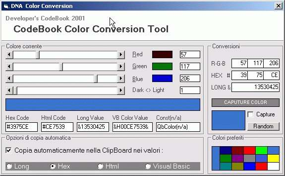



## ColorConvert

### Description

Ultimate Color Code Convert Tool,

Support conversion of RGB/HEX/LONG/HTML

Support VBColor(QBColor) and VBConst(vbYellow)

Other...Capture, Random, Light/Dark, Favorites

ClipBoard ecc.. MultiCoder Thanks of PSC
 
### More Info
 

             |
---                |---
**Submitted On**   |2002-03-07 15:45:12
**By**             |[Mark](https://github.com/Planet-Source-Code/PSCIndex/blob/master/ByAuthor/mark.md)
**Level**          |Advanced
**User Rating**    |5.0 (50 globes from 10 users)
**Compatibility**  |VB 4\.0 \(32\-bit\), VB 5\.0, VB 6\.0
**Category**       |[Miscellaneous](https://github.com/Planet-Source-Code/PSCIndex/blob/master/ByCategory/miscellaneous__1-1.md)
**World**          |[Visual Basic](https://github.com/Planet-Source-Code/PSCIndex/blob/master/ByWorld/visual-basic.md)
**Archive File**   |[ColorConve60122372002\.zip](https://github.com/Planet-Source-Code/mark-colorconvert__1-32433/archive/master.zip)

